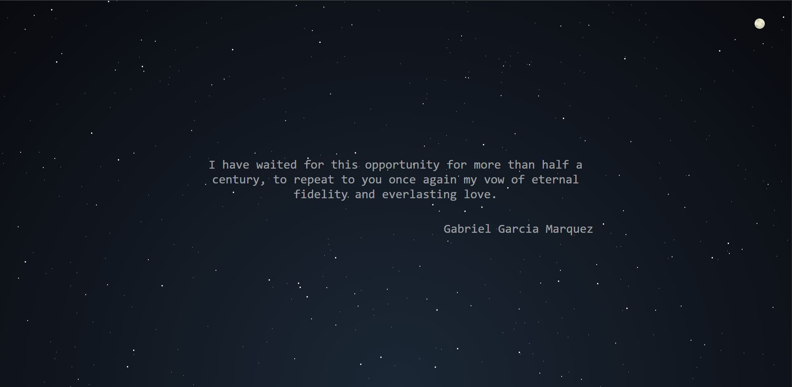

<br/>
<p align="center">
  <h3 align="center">Ai Phrases - Front</h3>

  <p align="center">
    This is a Api Website to generate random Quote
    <br/>
    <br/>
    <a href="https://iaphrases.live/">View Demo</a>
    .
    <a href="https://github.com/yosbp/ai-phrases-API">API Backend Code</a>
  </p>
</p>


## About The Project



This project consists of the frontend of a phrase API using Vue.js. It provides an intuitive and attractive user interface to interact with the API and display the obtained phrases. Includes Login, Api documentation and admin site to see and manage all phrases.
- Intuitive interface: The frontend has been designed to provide a smooth and pleasant user experience. 
- API consumption: The frontend communicates with the phrases API in the backend to fetch and display phrase data. It uses HTTP requests to access the endpoints provided by the API and display the results in the frontend.
- Reusable components: Reusable components have been created in Vue.js to improve modularity and ease code maintenance. This allows for greater efficiency in development and the ability to easily extend functionality in the future.
- Responsive design: The frontend is designed to adapt to different devices and screen sizes. CSS and responsive design techniques have been used to ensure an optimal user experience on desktops, tablets and mobile devices.

## Built With

- Vue.js.
- TailwindCSS to general styles.
- Ant Design to tables
- Axios to interact with Api

## Getting Started

This is an example of how you may give instructions on setting up your project locally.
To get a local copy up and running follow these simple example steps.

### Prerequisites

This is an example of how to list things you need to use the software and how to install them.

* npm

```sh
npm install npm@latest -g
```

### Installation

1. Need deploy Laravel Backend from [https://github.com/yosbp/ai-phrases-API] or create .env File with (VITE_URI = https://api.iaphrases.live/api) to use my public API.

2. Clone the repo

```sh
git clone https://github.com/your_username_/Project-Name.git
```

3. Install NPM packages

```sh
npm install
```

4. Enter your URI in `.env` File

```
VITE_URI = http://127.0.0.1:8000/api
```

5. Run your local host

```sh
npm run build
```
## License

Distributed under the MIT License.

## Authors

* **Yosmar Barco** - [Yosmar Barco](https://github.com/yosbp) - *Ai Phrases - Front*
